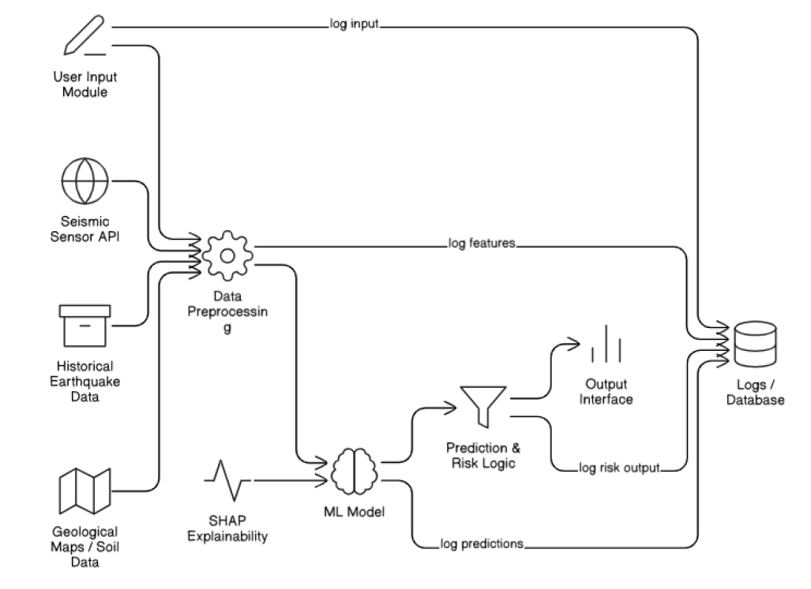

# 🌍 ImpactSense – Earthquake Impact Prediction ⚡

> 🚀 AI-Powered Earthquake Impact Prediction System for Smarter Disaster Planning, Risk Analysis & Emergency Response.

---

## 📜 Project Overview

The goal of *ImpactSense* is to develop a *machine learning model* that predicts the *impact of earthquakes* — such as *magnitude severity, **damage levels, or **risk zones* — using *geophysical & environmental data* (e.g., latitude, longitude, depth, seismic wave properties, soil type, and more).

This system empowers:
- 🏙 Governments for better *disaster preparedness*
- 🏗 City planners for *infrastructure safety*
- 🚨 Emergency teams for *effective response*

---

## 🔍 Use Cases

### 🏙 Urban Risk Assessment
- *Description:* Predict potential impact in populated regions based on historical and geophysical data.
- *Example:* Identify high-risk areas during a 5.5 magnitude earthquake using soil type and location.

### 🏗 Infrastructure Planning
- *Description:* Guide construction codes and safety policies in earthquake-prone zones.
- *Example:* Predict risk level based on soil density and proximity to fault lines.

### 🚨 Government Disaster Response
- *Description:* Prioritize rescue and aid delivery based on predicted damage severity.
- *Example:* Rank affected areas for emergency response post-earthquake.

---

## 🎯 Project Outcomes

By completing this project, you will:

✅ Understand seismic data & its predictive significance  
✅ Preprocess and analyze geospatial & geophysical features  
✅ Train & evaluate ML models for classification or regression  
✅ (Optional) Deploy the model with a simple UI  
✅ Visualize and document model performance 📊

---

## 📊 Dataset

- *Source:* [Kaggle – Earthquake Data](https://www.kaggle.com/)  
- Data includes seismic readings: latitude, longitude, depth, magnitude, geological parameters, etc.

---

## 🏗 System Architecture

---

## 🧩 Modules Overview

### 1️⃣ Data Exploration & Cleaning
- 📁 Load dataset  
- 🧹 Handle duplicates & missing values  
- 📊 Visualize key variables (depth, magnitude, coordinates)

### 2️⃣ Feature Engineering
- ⚖ Normalize/scale numeric features  
- 🧠 Create geospatial clusters or risk scores  
- 🔤 Encode categorical variables (if any)

### 3️⃣ Model Development
- 🤖 Train ML models: Logistic Regression, Random Forest, XGBoost  
- 🔎 Experiment with non-linear models

### 4️⃣ Model Evaluation
- 📈 Metrics: Accuracy, F1-score, MAE/MSE  
- 🔥 Visuals: Confusion Matrix, Feature Importance

### 5️⃣ (Optional) User Interface
- 🖥 Streamlit or FastAPI form  
- ✍ Input: magnitude, depth, region, soil type  
- 📤 Output: predicted impact or risk category

---

## 📆 Milestone Plan

| 🗓 Week | Milestone | Key Deliverables |
|--------|-----------|------------------|
| 1 | 📁 Project Setup & Data Understanding | Load dataset, explore distributions, map earthquake locations |
| 2 | 🧹 Preprocessing & Feature Engineering | Clean data, handle missing values, scale features |
| 3 | ⚙ Baseline Model Training | Logistic Regression, Decision Tree, baseline metrics |
| 4 | 🤖 Advanced Model Training | Random Forest, Gradient Boosting, hyperparameter tuning |
| 5 | 📊 Evaluation & Explainability | Confusion matrix, MAE/MSE, SHAP feature importance |
| 6 | 🖥 UI Prototype | Streamlit/FastAPI input form with prediction output |
| 7 | 🧪 Testing & Improvements | Edge cases, model optimization |
| 8 | 📑 Final Report & Presentation | Visualizations, final results, slides |

---

## 🧪 Evaluation Criteria

### 📍 Milestone Completion
- ✅ Data understanding & cleaning  
- ✅ Model training & evaluation  
- ✅ UI integration (optional)  
- ✅ Documentation & final presentation

### 📍 Prediction Quality
- 📊 High accuracy & F1-score  
- 🔍 Sensitivity to input variations  
- 🌐 Realistic output predictions

### 📍 Documentation & Presentation
- 🧭 Logical flow  
- ✍ Clear methodology  
- 📊 Clean graphs & visuals  
- 🎤 Effective demo explanation

---

## 📈 Model Performance Metrics

### 🧠 Classification Metrics
- ✅ *Accuracy:* % of correct risk predictions  
- ✅ *Precision:* Correctness of “High-Risk” predictions  
- ✅ *Recall:* Coverage of true “High-Risk” cases  
- ✅ *F1-Score:* Balance between precision & recall  
- ✅ *Confusion Matrix:* True vs Predicted classes

### 📉 Regression Metrics (if predicting damage scale)
- 📏 *MAE (Mean Absolute Error)*  
- 📏 *MSE (Mean Squared Error)*  
- 📊 *R² Score (Coefficient of Determination)*

### 🔎 Feature Importance
- 🌍 Which features (e.g., depth, location, magnitude) influence predictions  
- 📊 Visualize with SHAP or feature importance chart

### 📊 Training Curves
- 📉 Plot training vs validation loss  
- 🧠 Detect overfitting or underfitting

---

## 🚀 Future Scope

🔮 Integrate real-time seismic data APIs  
🌐 Deploy as a public web app for disaster management  
📡 Add alert notifications for high-risk regions

---

## 🛠 Tech Stack

| Component | Technology |
|----------|------------|
| 💻 Language | Python |
| 📊 Data | Pandas, NumPy |
| 🤖 ML | Scikit-learn, XGBoost |
| 📈 Visualization | Matplotlib, Seaborn |
| 🖥 UI | Streamlit / FastAPI |
| ☁ Deployment | (Optional) Heroku / AWS |

---

## 🏆 Team & Credits

👨‍💻 Developed as part of *Infosys Springboard Internship Project*  
🎓 ImpactSense – Earthquake Impact Prediction System

---

⭐ *If you like this project, don’t forget to star ⭐ the repo!*
